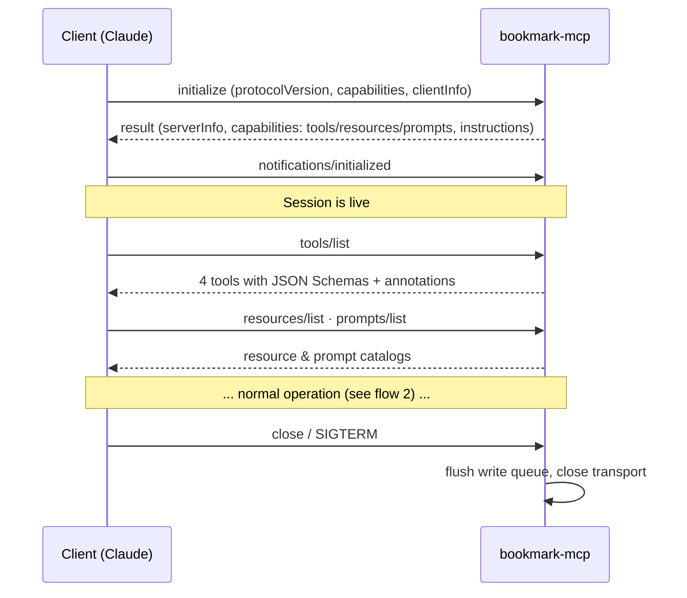
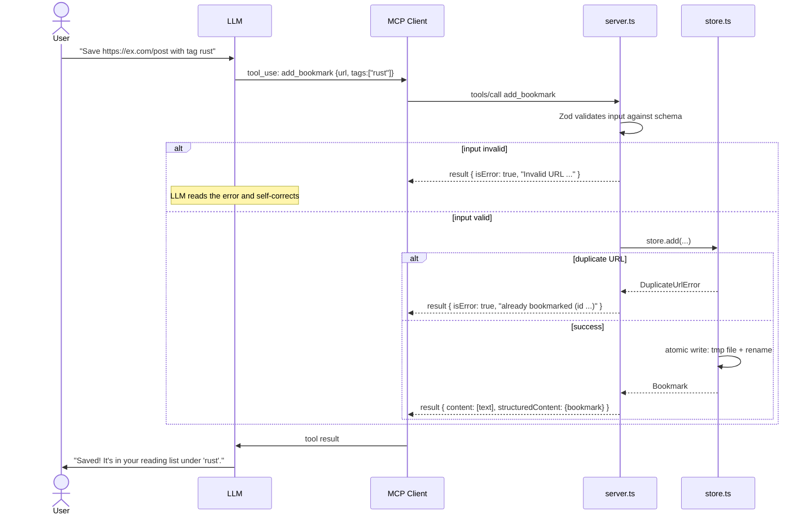
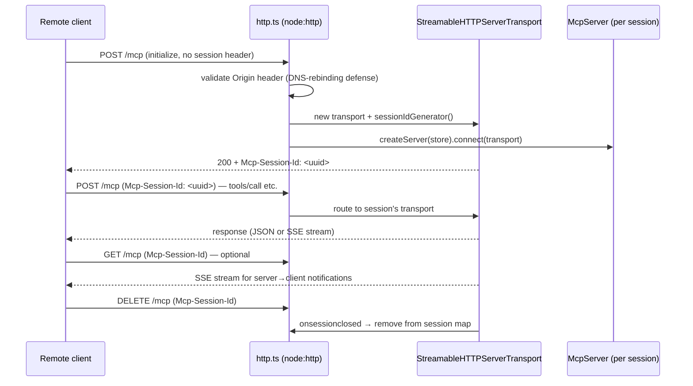
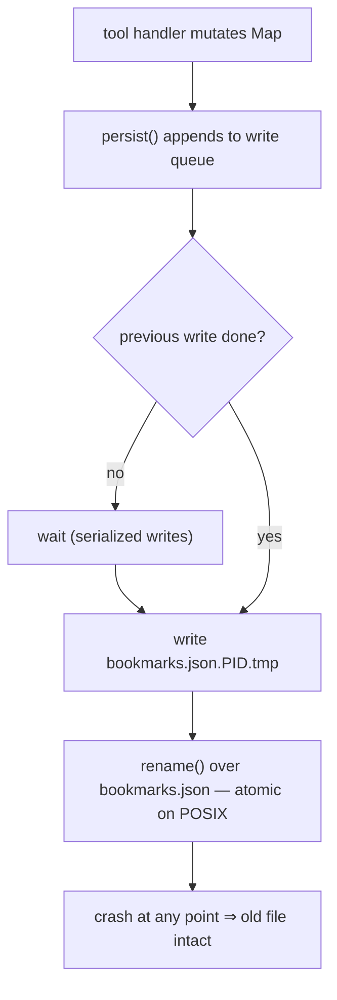
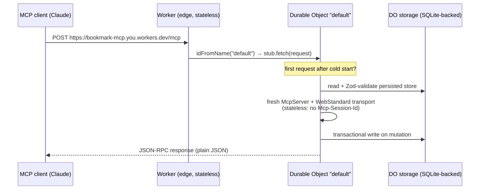

# bookmark-mcp — a production-ready MCP server showcase

A deliberately **simple business case** (a personal bookmark / reading-list manager) implemented the **current standard way** to build a Model Context Protocol server, so you can focus entirely on the technology:

- **TypeScript** + the official [`@modelcontextprotocol/sdk`](https://github.com/modelcontextprotocol/typescript-sdk) (high-level `McpServer` API)
- All three MCP primitives: **tools**, **resources** (static + templates), **prompts**
- **Local dev & testing** on stdio / Node HTTP — **production on Cloudflare Workers** (Durable Object storage, deployed with one command)
- **Zod** schemas as the single source of truth for validation, TypeScript types, and the JSON Schema shown to clients
- Structured tool output (`outputSchema` + `structuredContent`) and tool **annotations** (`readOnlyHint`, `destructiveHint`, …)
- Production patterns: pluggable storage adapters, stderr-only logging, atomic file writes, in-band error handling, origin validation, graceful shutdown, health endpoint
- **End-to-end tests** with a real MCP client over the SDK's in-memory transport

```
src/
├── index.ts          # entrypoint: stdio transport (local use with Claude Code/Desktop)
├── http.ts           # entrypoint: Node Streamable HTTP (local/self-hosted, session-managed)
├── worker.ts         # entrypoint: Cloudflare Worker + Durable Object  ← PRODUCTION
├── server.ts         # MCP layer: registers tools, resources, prompts (transport-agnostic)
├── store.ts          # domain layer: BookmarkStore (runtime-agnostic, no node:* imports)
├── storage/
│   ├── file.ts       # StorageAdapter: JSON file with atomic writes (Node only)
│   └── memory.ts     # StorageAdapter: in-memory (tests)
├── schemas.ts        # Zod schemas: validation + types + JSON Schema, all from one place
├── config.ts         # env-var configuration (Node entrypoints)
├── logger.ts         # structured logger (stderr on Node, log stream on Workers)
├── server.test.ts    # end-to-end protocol tests (client ↔ server, in-memory)
└── store.test.ts     # domain unit tests
wrangler.jsonc        # Cloudflare deployment config (DO binding + migration)
```

---

## Why a bookmark manager?

The use case fits in one sentence — *"save URLs, find them again, mark them read"* — so every line of code is about **how to build an MCP server**, not about understanding a domain. Yet it is rich enough to exercise everything: create/read/update/delete actions, search filters, derived data (tag stats), duplicates and not-found errors, and persistence.

## Quick start

```bash
npm install
npm test            # 15 end-to-end + unit tests
npm run dev         # run on stdio (for MCP clients)
npm run dev:http    # Node server on http://127.0.0.1:3000/mcp
npm run dev:worker  # the PRODUCTION worker, locally in workerd (http://localhost:8787/mcp)
npm run inspect     # open the MCP Inspector UI against this server
npm run deploy      # ship to Cloudflare Workers (needs `npx wrangler login` once)
```

### Connect it to Claude Code

```bash
claude mcp add bookmarks -- npx tsx /absolute/path/to/playground_mcp/src/index.ts
```

### Connect it to Claude Desktop

```json
{
  "mcpServers": {
    "bookmarks": {
      "command": "npx",
      "args": ["tsx", "/absolute/path/to/playground_mcp/src/index.ts"],
      "env": { "BOOKMARKS_FILE": "/Users/you/bookmarks.json" }
    }
  }
}
```

Then ask things like *"bookmark https://example.com/article with tag testing"*, *"what's unread in my reading list?"*, or invoke the `reading_digest` prompt.

### Configuration

| Env var          | Default                | Used by                          |
| ---------------- | ---------------------- | -------------------------------- |
| `BOOKMARKS_FILE` | `./data/bookmarks.json`| both transports                  |
| `LOG_LEVEL`      | `info`                 | both (`debug`/`info`/`warn`/`error`) |
| `PORT`           | `3000`                 | HTTP only                        |
| `HOST`           | `127.0.0.1`            | HTTP only                        |

---

## Architecture

Two design decisions make the "test locally, run on Cloudflare" split cheap:

1. **The MCP layer is transport-agnostic.** `createServer()` builds the same server whether it is served over stdio, Node HTTP, the Workers transport, or an in-memory pipe in tests.
2. **The domain layer is runtime-agnostic.** `store.ts` uses only Web-standard APIs (no `node:*` imports) and persists through a 2-method `StorageAdapter` port. The file adapter is for laptops; the Durable Object adapter is production; the memory adapter is for tests.

```mermaid
flowchart LR
    subgraph Clients
        CD["Claude Desktop / Claude Code"]
        IN["MCP Inspector"]
        T["Vitest test client"]
    end

    subgraph Entrypoints
        STDIO["index.ts<br/>stdio (local dev)"]
        HTTP["http.ts<br/>Node Streamable HTTP"]
        CF["worker.ts<br/>Cloudflare Worker + DO (production)"]
        MEM["InMemoryTransport<br/>(tests)"]
    end

    subgraph Server["server.ts — createServer()"]
        TOOLS["Tools<br/>add_bookmark · search_bookmarks<br/>mark_read · delete_bookmark"]
        RES["Resources<br/>bookmarks://all · bookmarks://stats<br/>bookmarks://bookmark/{id}"]
        PROMPTS["Prompts<br/>reading_digest"]
    end

    subgraph Domain["store.ts — BookmarkStore (runtime-agnostic)"]
        STORE["StorageAdapter port"]
    end

    FILE[("storage/file.ts<br/>bookmarks.json, atomic writes")]
    DO[("Durable Object storage<br/>strongly consistent")]
    RAM[("storage/memory.ts")]

    CD --> STDIO
    IN --> STDIO
    CD -.https://….workers.dev/mcp.-> CF
    T --> MEM
    STDIO --> Server
    HTTP --> Server
    CF --> Server
    MEM --> Server
    TOOLS --> Domain
    RES --> Domain
    PROMPTS --> Domain
    STORE --> FILE
    STORE --> DO
    STORE --> RAM
```

### The three MCP primitives — who controls what

| Primitive | Controlled by | This server | Typical UI |
| --------- | ------------- | ----------- | ---------- |
| **Tools** | the **model** — the LLM decides when to call them | `add_bookmark`, `search_bookmarks`, `mark_read`, `delete_bookmark` | tool-use with permission prompt |
| **Resources** | the **application** — the client attaches them as context | `bookmarks://all`, `bookmarks://stats`, `bookmarks://bookmark/{id}` (template) | "attach context" picker |
| **Prompts** | the **user** — explicitly invoked | `reading_digest` | slash command / menu |

---

## Flows

### 1. Connection lifecycle (initialize handshake)

Every MCP session, on any transport, starts with the same three-step handshake in which client and server negotiate protocol version and capabilities:



### 2. Tool call flow (what happens on "bookmark this URL")



Two error channels, used deliberately:

- **In-band tool errors** (`isError: true`) for *expected* business failures — duplicates, not-found, invalid input. The LLM sees the message and can recover (e.g. search for the existing bookmark instead).
- **Protocol errors** (JSON-RPC errors / thrown exceptions) only for *unexpected* bugs.

### 3. Streamable HTTP session lifecycle (Node self-hosted variant)

The stdio transport is one process per client — no session management needed. The Node remote server uses Streamable HTTP with explicit sessions:



All sessions share one `BookmarkStore`, so the data is consistent across clients; each session gets its own `McpServer` instance, so protocol state never leaks between clients.

### 4. Persistence: why writes can't corrupt the data

Locally (FileStorage adapter):



In production the Durable Object gives the same guarantees for free: its storage API is transactional, and the DO is single-threaded so writes are serialized by the platform itself.

---

## Production: Cloudflare Workers

[worker.ts](src/worker.ts) is the production entrypoint. The stateless Worker routes every request to **one named Durable Object instance**, which owns the data and runs the MCP server:



Why this shape:

- **Stateless MCP** (`sessionIdGenerator: undefined`, `enableJsonResponse: true`): serverless requests may hit any isolate, so there are no sticky sessions to manage — each POST is self-contained. This is the recommended pattern for serverless MCP hosting.
- **One DO = the consistency boundary.** DO storage is strongly consistent and the instance is single-threaded, so concurrent clients can't corrupt data — the platform replaces both the atomic file writes and the write queue we need locally.
- **`McpAgent` alternative:** Cloudflare's `agents` framework is the batteries-included route (per-session DOs, hibernation, OAuth templates). It needs external shared storage (KV/D1) because each *session* gets its own DO; the single shared DO here keeps the showcase self-contained and dependency-light. Reach for `McpAgent` when you need server→client notifications or the OAuth flow.
- **Multi-tenancy is one line away:** derive the DO name from the authenticated user (`idFromName(userId)`) and every user gets an isolated store.

### Deploy

```bash
npx wrangler login        # once
npm run deploy            # builds + ships; prints https://bookmark-mcp.<you>.workers.dev
```

Connect Claude to the deployed server:

```bash
claude mcp add --transport http bookmarks https://bookmark-mcp.<you>.workers.dev/mcp
```

Local test of the *exact* production code path (runs in `workerd`, with a local DO):

```bash
npm run dev:worker        # http://localhost:8787/mcp + /healthz
```

Before sharing the URL publicly, add auth — simplest is Cloudflare Access in front of the route; the full-fidelity option is the MCP OAuth 2.1 flow (`workers-oauth-provider`). The free plan (100k requests/day, SQLite-backed DOs included) comfortably covers personal use.

---

## Production patterns demonstrated

| Concern | Where | Pattern |
| ------- | ----- | ------- |
| **stdout discipline** | [logger.ts](src/logger.ts) | On stdio, stdout *is* the protocol. One stray `console.log` kills the session — all logs are structured JSON on **stderr**. |
| **Validation at the boundary** | [schemas.ts](src/schemas.ts) | Zod raw shapes with `.describe()` on every field → runtime validation + TS types + JSON Schema for the LLM, from one definition. |
| **Structured output** | [server.ts](src/server.ts) | Tools declare `outputSchema` and return `structuredContent` next to human-readable `content`. |
| **Tool annotations** | [server.ts](src/server.ts) | `readOnlyHint` on search, `destructiveHint` on delete (clients can require confirmation), `idempotentHint` on mark_read. |
| **Recoverable errors** | [server.ts](src/server.ts) | Business failures are `isError: true` results the model can read; only bugs throw. |
| **Pluggable storage** | [store.ts](src/store.ts), [storage/](src/storage) | Runtime-agnostic domain layer + 2-method `StorageAdapter` port: file (local), Durable Object (production), memory (tests). |
| **Durable writes** | [storage/file.ts](src/storage/file.ts), [worker.ts](src/worker.ts) | Locally: temp-file + `rename()` atomic writes behind a write queue. In production: transactional DO storage. Corrupt data fails loudly at startup. |
| **Remote security** | [http.ts](src/http.ts) | Origin validation, `127.0.0.1` binding by default, per-session transports, `/healthz` for orchestrators. |
| **Graceful shutdown** | both entrypoints | SIGINT/SIGTERM close sessions and the transport before exiting. |
| **Testing** | [server.test.ts](src/server.test.ts) | A real `Client` over `InMemoryTransport.createLinkedPair()` exercises the full JSON-RPC stack without spawning processes. |
| **Config via env** | [config.ts](src/config.ts) | Matches how MCP clients pass configuration (`env` block in the client's server config). |

## Production checklist (what's still missing before a public launch)

The Workers deployment already covers TLS, scaling, durable storage, and observability (`wrangler tail` / dashboard logs). What this showcase deliberately leaves out:

1. **Authentication** — the MCP spec mandates OAuth 2.1 for remote servers. On Cloudflare: `workers-oauth-provider` (full spec flow) or Cloudflare Access with a service token (pragmatic personal setup). On Node: `@modelcontextprotocol/sdk/server/auth` helpers.
2. **Multi-tenancy** — currently all clients share one bookmark collection; derive the DO name from the authenticated user to isolate stores.
3. **Rate limiting & request size caps** — Cloudflare WAF rules or a rate-limit binding.
4. **Server→client notifications** — the stateless Worker pattern has no SSE channel; if you need `listChanged` notifications or progress streams, move to session-managed transports (Node `http.ts` already does this; on Workers use `McpAgent`).

## Extending the server

Adding a capability is a three-step pattern — schema, domain, registration:

1. Define the input shape in [schemas.ts](src/schemas.ts) with `.describe()` on every field.
2. Add the operation to [store.ts](src/store.ts) (plus a typed error class if it can fail in an expected way).
3. Register it in [server.ts](src/server.ts) with `registerTool` / `registerResource` / `registerPrompt`, and add a case to [server.test.ts](src/server.test.ts).

## Debugging

```bash
npm run inspect                      # MCP Inspector: interactive UI for tools/resources/prompts
LOG_LEVEL=debug npm run dev          # verbose stderr logs (Node)
npm test                             # full protocol round-trip without any client
npm run dev:worker                   # production code path locally (workerd + local DO)
npx wrangler tail                    # live logs from the deployed Worker
```
