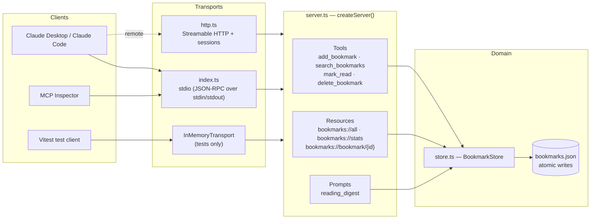
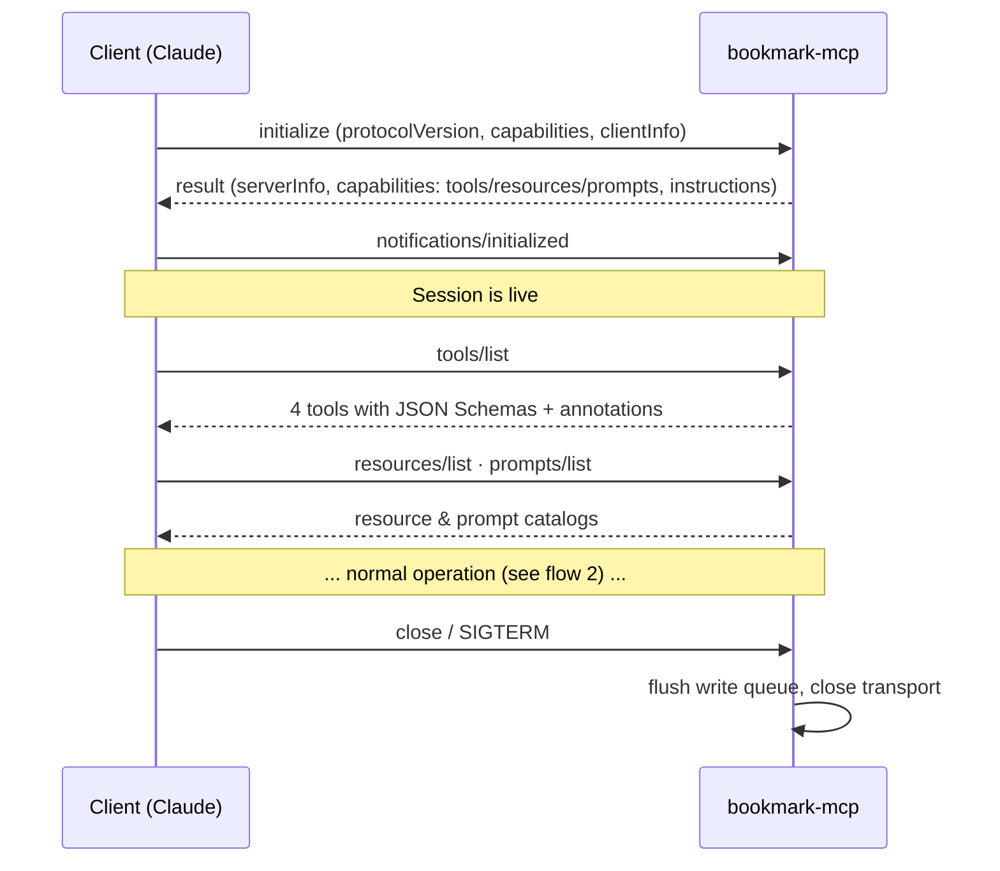
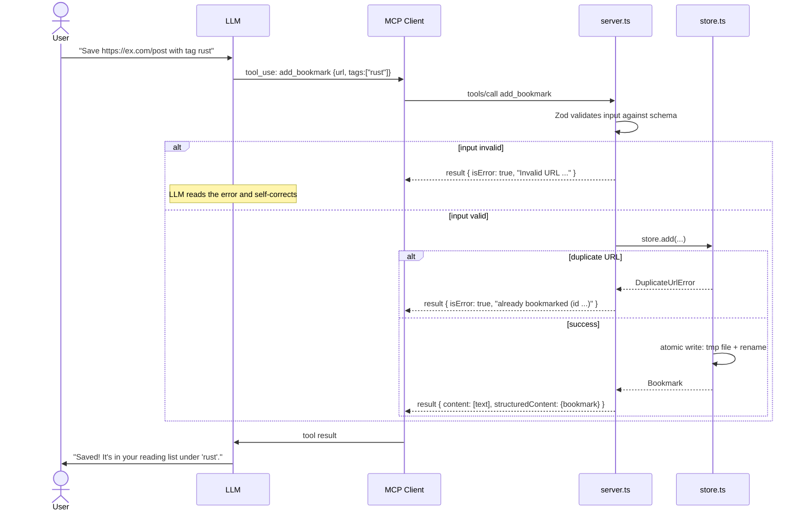
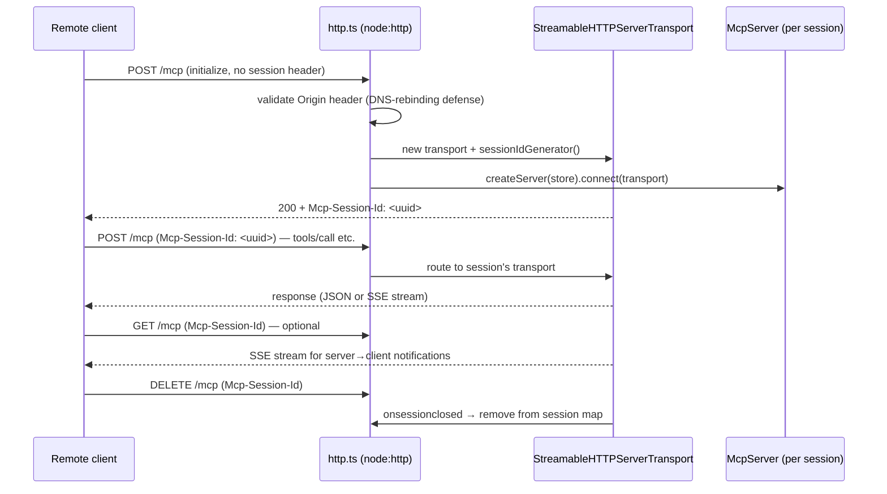
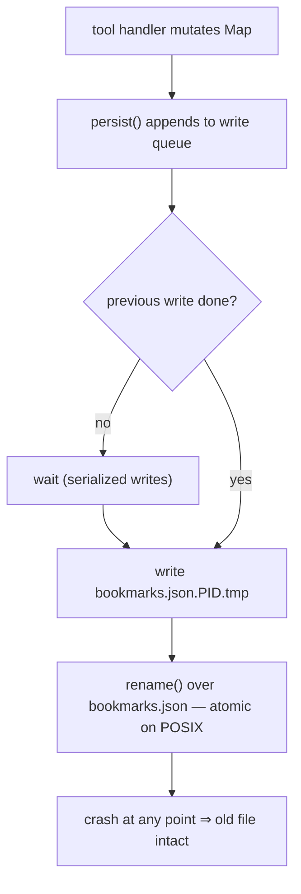

# bookmark-mcp — a production-ready MCP server showcase

A deliberately **simple business case** (a personal bookmark / reading-list manager) implemented the **current standard way** to build a Model Context Protocol server, so you can focus entirely on the technology:

- **TypeScript** + the official [`@modelcontextprotocol/sdk`](https://github.com/modelcontextprotocol/typescript-sdk) (high-level `McpServer` API)
- All three MCP primitives: **tools**, **resources** (static + templates), **prompts**
- Both standard transports: **stdio** (local) and **Streamable HTTP** (remote, session-managed)
- **Zod** schemas as the single source of truth for validation, TypeScript types, and the JSON Schema shown to clients
- Structured tool output (`outputSchema` + `structuredContent`) and tool **annotations** (`readOnlyHint`, `destructiveHint`, …)
- Production patterns: stderr-only logging, atomic file writes, in-band error handling, origin validation, graceful shutdown, health endpoint
- **End-to-end tests** with a real MCP client over the SDK's in-memory transport

```
src/
├── index.ts        # entrypoint: stdio transport (local use)
├── http.ts         # entrypoint: Streamable HTTP transport (remote use)
├── server.ts       # MCP layer: registers tools, resources, prompts
├── store.ts        # domain layer: JSON-file-backed bookmark store
├── schemas.ts      # Zod schemas: validation + types + JSON Schema, all from one place
├── config.ts       # env-var configuration
├── logger.ts       # structured stderr logger
├── server.test.ts  # end-to-end protocol tests (client ↔ server, in-memory)
└── store.test.ts   # domain unit tests
```

---

## Why a bookmark manager?

The use case fits in one sentence — *"save URLs, find them again, mark them read"* — so every line of code is about **how to build an MCP server**, not about understanding a domain. Yet it is rich enough to exercise everything: create/read/update/delete actions, search filters, derived data (tag stats), duplicates and not-found errors, and persistence.

## Quick start

```bash
npm install
npm test            # 14 end-to-end + unit tests
npm run dev         # run on stdio (for MCP clients)
npm run dev:http    # run on http://127.0.0.1:3000/mcp
npm run inspect     # open the MCP Inspector UI against this server
```

### Connect it to Claude Code

```bash
claude mcp add bookmarks -- npx tsx /absolute/path/to/playground_mcp/src/index.ts
```

### Connect it to Claude Desktop

```json
{
  "mcpServers": {
    "bookmarks": {
      "command": "npx",
      "args": ["tsx", "/absolute/path/to/playground_mcp/src/index.ts"],
      "env": { "BOOKMARKS_FILE": "/Users/you/bookmarks.json" }
    }
  }
}
```

Then ask things like *"bookmark https://example.com/article with tag testing"*, *"what's unread in my reading list?"*, or invoke the `reading_digest` prompt.

### Configuration

| Env var          | Default                | Used by                          |
| ---------------- | ---------------------- | -------------------------------- |
| `BOOKMARKS_FILE` | `./data/bookmarks.json`| both transports                  |
| `LOG_LEVEL`      | `info`                 | both (`debug`/`info`/`warn`/`error`) |
| `PORT`           | `3000`                 | HTTP only                        |
| `HOST`           | `127.0.0.1`            | HTTP only                        |

---

## Architecture

The key design decision: **the MCP layer is transport-agnostic**. `createServer()` builds the same server whether it is served over stdio, HTTP, or an in-memory pipe in tests. The domain layer (`BookmarkStore`) knows nothing about MCP at all — swapping JSON-file persistence for SQLite touches one file.



### The three MCP primitives — who controls what

| Primitive | Controlled by | This server | Typical UI |
| --------- | ------------- | ----------- | ---------- |
| **Tools** | the **model** — the LLM decides when to call them | `add_bookmark`, `search_bookmarks`, `mark_read`, `delete_bookmark` | tool-use with permission prompt |
| **Resources** | the **application** — the client attaches them as context | `bookmarks://all`, `bookmarks://stats`, `bookmarks://bookmark/{id}` (template) | "attach context" picker |
| **Prompts** | the **user** — explicitly invoked | `reading_digest` | slash command / menu |

---

## Flows

### 1. Connection lifecycle (initialize handshake)

Every MCP session, on any transport, starts with the same three-step handshake in which client and server negotiate protocol version and capabilities:



### 2. Tool call flow (what happens on "bookmark this URL")



Two error channels, used deliberately:

- **In-band tool errors** (`isError: true`) for *expected* business failures — duplicates, not-found, invalid input. The LLM sees the message and can recover (e.g. search for the existing bookmark instead).
- **Protocol errors** (JSON-RPC errors / thrown exceptions) only for *unexpected* bugs.

### 3. Streamable HTTP session lifecycle

The stdio transport is one process per client — no session management needed. Remote servers use Streamable HTTP, where sessions are explicit:



All sessions share one `BookmarkStore`, so the data is consistent across clients; each session gets its own `McpServer` instance, so protocol state never leaks between clients.

### 4. Persistence: why writes can't corrupt the data file



---

## Production patterns demonstrated

| Concern | Where | Pattern |
| ------- | ----- | ------- |
| **stdout discipline** | [logger.ts](src/logger.ts) | On stdio, stdout *is* the protocol. One stray `console.log` kills the session — all logs are structured JSON on **stderr**. |
| **Validation at the boundary** | [schemas.ts](src/schemas.ts) | Zod raw shapes with `.describe()` on every field → runtime validation + TS types + JSON Schema for the LLM, from one definition. |
| **Structured output** | [server.ts](src/server.ts) | Tools declare `outputSchema` and return `structuredContent` next to human-readable `content`. |
| **Tool annotations** | [server.ts](src/server.ts) | `readOnlyHint` on search, `destructiveHint` on delete (clients can require confirmation), `idempotentHint` on mark_read. |
| **Recoverable errors** | [server.ts](src/server.ts) | Business failures are `isError: true` results the model can read; only bugs throw. |
| **Durable writes** | [store.ts](src/store.ts) | Temp-file + `rename()` atomic writes, serialized through a write queue; corrupt files fail loudly at startup. |
| **Remote security** | [http.ts](src/http.ts) | Origin validation, `127.0.0.1` binding by default, per-session transports, `/healthz` for orchestrators. |
| **Graceful shutdown** | both entrypoints | SIGINT/SIGTERM close sessions and the transport before exiting. |
| **Testing** | [server.test.ts](src/server.test.ts) | A real `Client` over `InMemoryTransport.createLinkedPair()` exercises the full JSON-RPC stack without spawning processes. |
| **Config via env** | [config.ts](src/config.ts) | Matches how MCP clients pass configuration (`env` block in the client's server config). |

## Production checklist (what to add when you leave the laptop)

This showcase stays intentionally small. Before exposing the HTTP transport publicly you would add:

1. **Authentication** — the MCP spec mandates OAuth 2.1 for remote servers; the SDK ships helpers (`@modelcontextprotocol/sdk/server/auth`). Behind a private gateway, a bearer-token middleware may be sufficient.
2. **TLS** — terminate HTTPS at a reverse proxy; never ship tokens over plain HTTP.
3. **Real storage** — replace the JSON file in `store.ts` with SQLite/Postgres; nothing else changes.
4. **Rate limiting & request size caps** on the HTTP endpoint.
5. **Observability** — the structured stderr logs are ready for any log shipper; add metrics on session count and tool latency.
6. **Resumability** — pass an `eventStore` to `StreamableHTTPServerTransport` so clients can resume SSE streams after disconnects.

## Extending the server

Adding a capability is a three-step pattern — schema, domain, registration:

1. Define the input shape in [schemas.ts](src/schemas.ts) with `.describe()` on every field.
2. Add the operation to [store.ts](src/store.ts) (plus a typed error class if it can fail in an expected way).
3. Register it in [server.ts](src/server.ts) with `registerTool` / `registerResource` / `registerPrompt`, and add a case to [server.test.ts](src/server.test.ts).

## Debugging

```bash
npm run inspect                      # MCP Inspector: interactive UI for tools/resources/prompts
LOG_LEVEL=debug npm run dev          # verbose stderr logs
npm test                             # full protocol round-trip without any client
```
